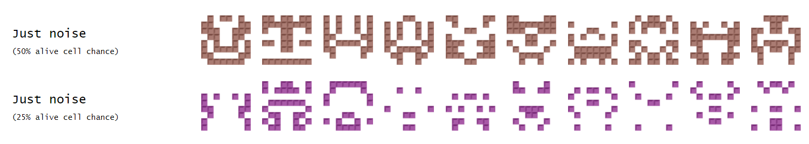
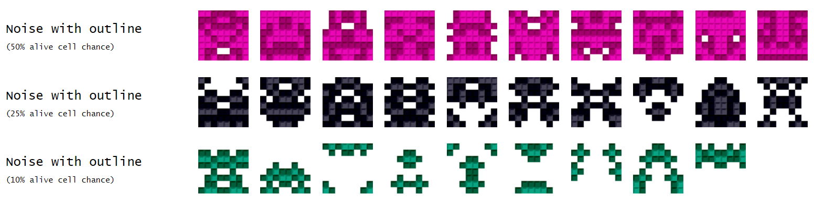
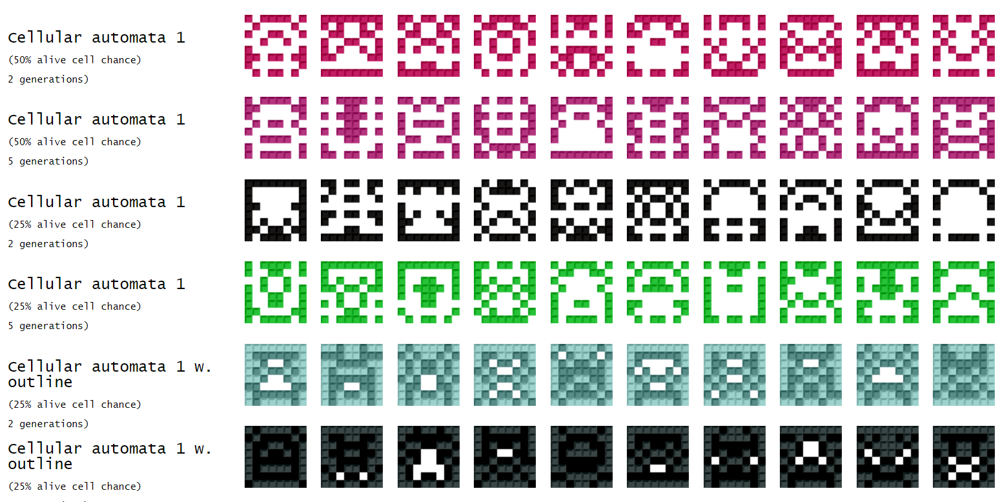
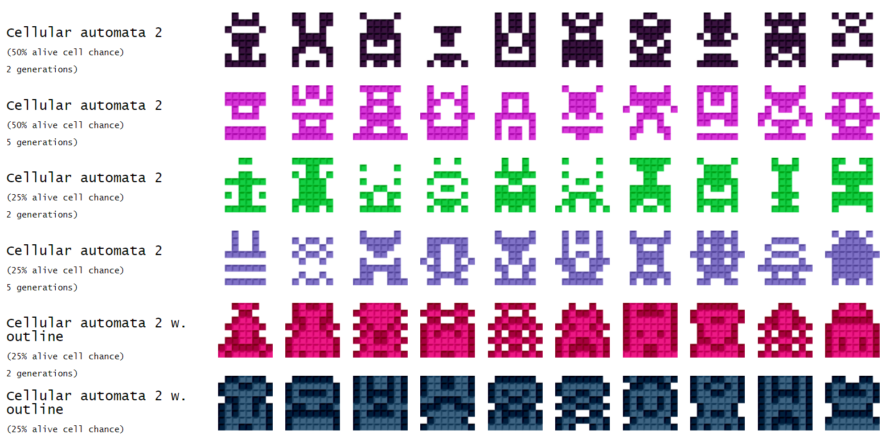
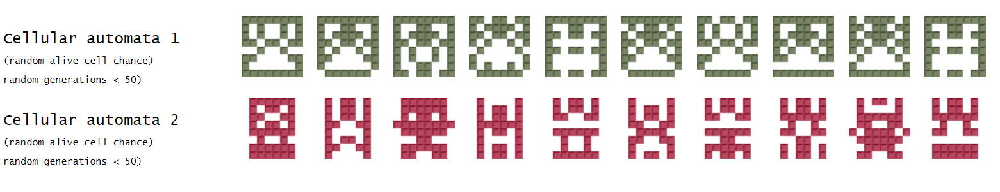
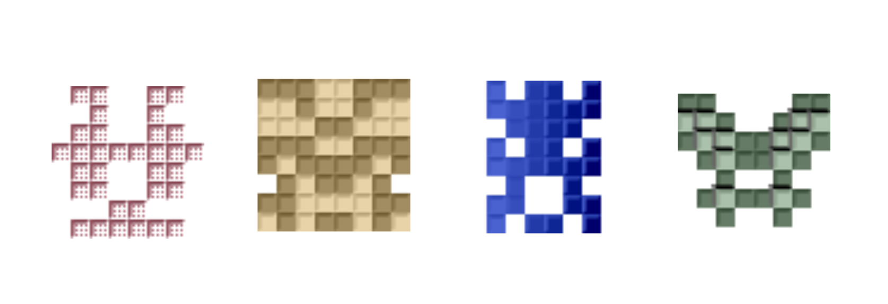

## Sprite generation
Generation and rending of retro style sprites with different approaches. A fun little hobby project.

## Examples of styles

## Usage
Clone the repository and open the "sprites.html" file.
The project uses Typescript so if you want to extend it, you can
- Install typescript (https://code.visualstudio.com/docs/typescript/typescript-compiling)
- open the project folder and run "tsc -b" (use "tsc -w" for watch mode)
- open the sprites.html file

## Further improvements
- Better explanations of the methods used
- Experimentation with different randomness algorithms
- Experimentation with more cellular automata
- UI for tweaking the alive cell chance, generation count and sprite size
- UI for selecting whether to render with an outline
- Separate rendering from the generation so that selecting checkboxes doesn't trigger regeneration
- Incorporate the 'spaceship' method (with masks) from <a href="http://web.archive.org/web/20080228054410/http://www.davebollinger.com/works/pixelspaceships/">Dave Bollinger</a> and <a href="https://github.com/zfedoran/pixel-sprite-generator">zfedoran</a> (maybe looking at seiyrias <a href="https://github.com/seiyria/mixel">mixel</a>)

## Based on ideas by

<a href="https://github.com/yurkth/sprator">Yurkth</a> - original idea for sprite generation 
 
<a href="https://github.com/markuszeller/avatarro">Avatarro</a> - sprites just using noise with outlines
 
<a href="https://imgur.com/gallery/QJjdAPh">Iamtheonlymeiknow</a> - shading of the squares
 
<a href="https://ljvmiranda921.github.io/projects/2020/03/31/cellular-sprites/">LJ MIRANDA</a> - sprites with conways game of life